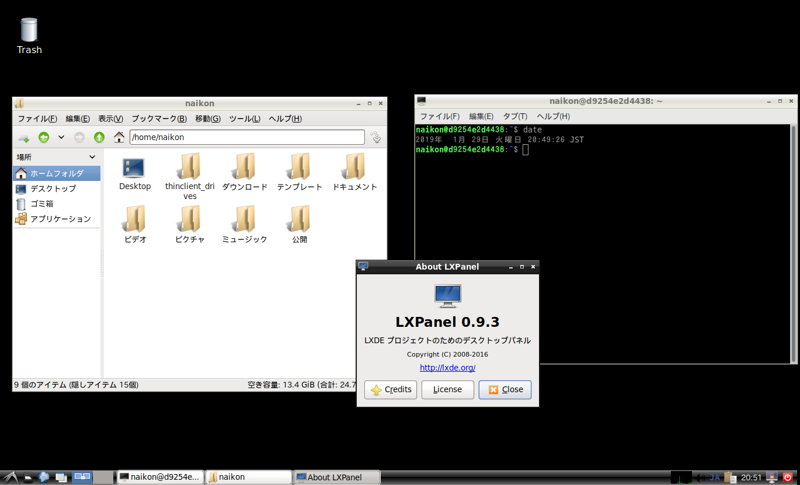

## Docker file of Ubuntu Desktop + RDP, SSH
   




### Features
  
- Ubuntu18.04 desktop with Japanese language pack
- xrdp server
- ssh server

### Usage

- #### docker build
  ```
  - sudo docker build -t IMAGENAME:TAG -f Dockerfile.ubuntu1804 .
  ```
- #### docker run
  ```
  - sudo docker run \
    -p 3389:3389 \ # RDP port
    -p 22:22     \ # SSH port
    -u $(id USERNAME -u):$(id USERNAME -g) \ # set UID, GID of user
    -e USER=LOGINUSER -e PASSWD=LOGINPW \ # xrdp login user/pw
    --shm-size=1g

  - access to (TARGETIP):3389 using RDP client software
  ```
  
